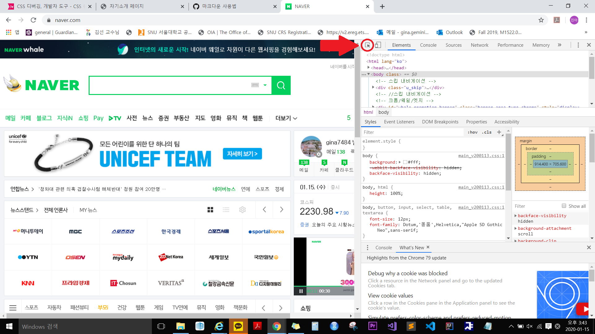

CSS 중급 내용 정리
=============
1.Cross Browse
-------------
#### Layout engine(렌더링 엔진)
  + 브라우저의 엔진이다. 브라우저를 실질적으로 렌더링해준다.
  + 다른 브라우저라도 같은 엔진을 사용한다면 거의 비슷하게 보여진다.
  + Cross Browsing할 때 각 브라우저들을 엔진 별로 확인하자
  + engine 종류
  
      </img><br/>
      
      
#### CSS 초기화
  * concept
    - 브라우저가 자체적으로 CSS 스타일을 가지고 있는데 엔진마다 조금씩 다르다.
    - 브라우저에서 기본적으로 들어가는 margin, padding 때문에 혼동이 올 수도 있음
    - CSS 초기화: 작업의 편리성을 위해 차이나는 부분들에 미리 스타일을 주는 방식
    - 정답이 없다. 초기화 CSS는 검색엔진을 통해 조금만 검색해봐도 예시가 많이 나오니, 그 예시들을 복사해서 사용해도 된다.
  * 권장사항
    - 초기화는 정말 최소한의 스타일만 주자 (여백 정도의 최소한만)
      - 대형 사이트에서 부분적 개편할 때 개편이 아직 안된 페이지들(잘못된 초기화 CSS를 그대로 사용하고 있는 페이지)로 인해 잘못된 초기화 CSS를 또 다시 계속 써야만 하는 상황이 올 수도 있음.
      - 처음 공부하는 입장이라면, 한번 초기화 없이 CSS를 작성해서 크로스 브라우징 해보는 것도 좋은 방법
    - 속성의 상속을 무시하게 만들지 말 것
      - ex: font-size를 다음과 같이 선언하고 p의 font-size를 바꿔줬을 때, span도 부모의 속성을 따라가기 바라지만 CSS 초기화때문에 안된다.

          ```
          * {
            margin: 0;
            padding: 0;
            font-size: 12px;
            font-family: 돋움, 'dotum', arial, helvetica, sans-serif;
          }
          ```
          ```
          <p>동해 물과 <strong>백두산</strong>이 마르고 닳도록...</p>
          ```
          
#### IE의 cross browsing
  - IE는 사용자가 윈도우 업데이트 해야 업데이트가 되기 때문에 IE 버전 별로도 크로스 브라우징 해야함.
  - IE Hack
    - 스타일을 줄 때 특수문자를 넣어서, 다른 브라우저들에서는 인식을 못하지만, IE의 특정 버전의 브라우저에서는 인식하게 하는 방법
      ```
      div {
        color: red;
        *color: blue; /* IE7이하 용 */
        _color : green; /* IE6 용 */
      }
      ```
  - IE용 주석 이용 (conditional comments)
  


#### 메타를 이용한 IE 모드
    
<br/>


2.CSS debugging, 개발자 도구
-------------
</img><br/>

- 개발자 도구에 들어가서 표시된 부분 누르고 보이는 페이지에서 원하는 부분 누르면 관련 정보가 나온다.
- 속성 중 덮어 씌어진 속성이 있다면, 취소선의 형태로 보여줍니다. 여러분들은 이를 통해서 본인이 넣은 속성이 다른 속성에 의해 덮어씌워진 건 아닌지 등을 확인할 수 있습니다. 그리고 해당 속성의 체크마크를 해제함으로 써, 임시로 해당 속성을 지울 수도 있습니다. 반대로 스타일 속성을 줄 수도 있습니다. (보통 속성 부분에서 빈 공간을 클릭하면 새로운 속성 입력 칸이 보여집니다.) 또한 우측 클릭 후 규칙 추가로 (크롬에서는 상단 '+'모양의 아이콘입니다.) 선택자마저도 추가 할 수 있습니다. 다만 이러한 속성의 수정은 임시로 확인하기 위함이며, 해당 페이지엔 실제로 영향을 주지 않습니다. (보통 새로 고침을 하게 되면 모든 것이 원래대로 돌아옵니다.) 그렇기 때문에 실질적인 수정은 소스에 직접 하시기 바랍니다.
- 소스를 수정하기 위해서는 어떤 CSS파일에서 어떤 부분을 수정해야 하는지 찾아야 합니다. 이런 것은 선택자 표시 우측을 보면, 'style.css:8'과 같은 표시를 볼 수 있을 것입니다. 이는 style.css파일의 8번째 줄을 가리키는 것입니다. 그렇기 때문에 여러분 들은 해당 부분을 수정하려면 style.css파일을 열고 8번째 줄을 찾아가면 됩니다.
-'style.css:8'과 같은 부분을 클릭하면 CSS파일 원본 소스를 보여주어, 해당 부분에서 소스를 수정할 경우, 웹 브라우저도 실시간으로 변화되어 표시됩니다. (파이어 폭스에서는 스타일 편집기라는 탭으로 존재하며, IE에서는 아직 실시간 편집을 지원하지 않습니다.) 이런 부분은 CSS를 실시간으로 보며 소스를 작성할 수 있기 때문에, 초보자 분들은 사용해 보시는 것도 괜찮을 것 같습니다. 다만, 이 역시 임시적인 편집으로, 해당 CSS를 별도로 저장하지 않는다면 새로 고침 시 모두 편집 이전으로 돌아가니, 주의 하시기 바랍니다.
- 박스 모델을 통해서 이 요소의 너비와 높이, 또한 내부와 외부의 여백, 테두리 선의 굵기 등을 파악할 수 있음

3.CSS selector 2
-------------


4.다중 CSS style sheet & 우선순위
-------------


5.display & visibility
-------------
#### display 속성
  ```
  div {
    display: inline-block;
  }
  ```
  - block
  - inline
  - inline-block
    - 요소 자체로 줄 바꿈이 일어나지는 않음 (inline 요소의 특성)
    - height와 width 값을 가질 수 있다 (block 요소의 특성)
    - 줄 바꿈을 하지 않은 상태로 버튼을 만들 때 유용하게 쓰임
    - IE 7 이하에서 구현하는 방식: [3번째 슬라이드](http://webberstudy.com/html-css/css-2/display-and-visibility-property/) 참고
  - none
    - 요소를 보여주지 않는다. 
    - 주로 javascript와 함께 동적인 페이지 구현시 활용된다. 
    - 탭이나 메뉴 등에서 내용을 보이거나 감추거나 할 때 쓰임. 

#### visibility 속성
  - visible : 기본 값. 요소를 보여준다
  - hidden: 요소를 보여주지 X
    - display: none와의 차이점
      - display:none : 해당 요소가 흔적도 없이 사라짐
      - visibility:hidden : 해당 요소의 영역을 남겨 놓는다.
  - collapse : table 요소들에서만 줄 수 있는 값.
    - 테이블의 전체적인 레이아웃이 깨지지 않도록, display:none 또는 visibility:hidden을 자동으로 적용.


6.overflow, float, clear
-------------
#### overflow
- 안의 콘텐츠가 박스를 벗어날 때 어떻게 처리할지 결정
- 속성값들
  - visible: 기본 값으로, 박스를 벗어나는 콘텐츠가 그대로 보여집니다.
  - scroll: 우측에 스크롤 바를 노출하여, 스크롤 바를 통해 콘텐츠를 확인할 수 있도록 합니다.
  - hidden: 벗어나는 콘텐츠를 모두 숨겨버립니다.
  - auto: scroll 속성 값은 스크롤 바가 항상 노출 되지만, auto 속성 값은 콘텐츠가 박스를 벗어날 때에만 스크롤 바를 노출합니다.
  - inherit: 부모의 속성 값을 물려 받습니다.
- [overflow 속성값 결과](http://webberstudy.com/html-css/css-2/overflow-float-clear/) 2번째 슬라이드 참고

#### float 속성
- 왼쪽이나 오른쪽으로 float 속성을 적용한 요소의 다음 요소들(float나 clear를 주지 않은 요소) 안의 텍스트(또는 인라인 요소)들은 적용한 요소 옆에 위치하게 됩니다.
- 참고 그림: [float를 이용한 본문의 요소 삽입](http://webberstd.cdn1.cafe24.com/img/css-2/clear-float.png)
- 속성값들: none, left, right, inherit

#### clear 속성
- float을 사용해서 이미지 등을 본문에 넣었다가, 이미지 옆에서가 아닌, 이미지 아래에서 새로운 섹션을 시작하고 싶을 때 사용
- float를 해제시킴으로써 줄 바꿈 되어 구역을 새롭게 시작
- 속성값들: none, left, right, both, inherit

7.float 레이아웃
-------------


8.table style
-------------

